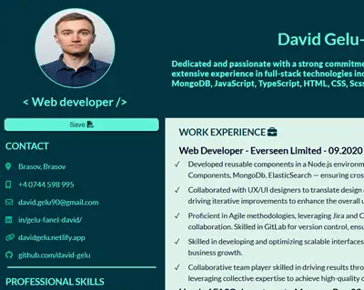

# Interactive CV App — React + TypeScript

> A traditional CV reimagined as a modern web application — interactive, structured, and exportable as a PDF.

[](https://davidgelu-cv.netlify.app)
[](https://react.dev/)
[](https://www.typescriptlang.org/)
[](https://vitejs.dev/)

---

## 📸 Preview

  
> 🔗 **[View live →](https://davidgelu-cv.netlify.app)**

---

## ✨ Features

- **Interactive CV layout** — structured sections for experience, skills, education, and contact
- **PDF export** — download a formatted PDF version directly from the browser using `@react-pdf/renderer`
- **Font Awesome icons** — professional iconography throughout the UI
- **Responsive design** — readable and well-structured on all screen sizes
- **Component-based architecture** — each CV section is an isolated, reusable component
- **Easy to update** — content and presentation are cleanly separated

---

## 🛠️ Tech Stack

| Technology | Purpose |
|---|---|
| React 19 + TypeScript | UI framework |
| Vite 6 | Build tool & dev server |
| `@react-pdf/renderer` | In-browser PDF generation & download |
| Font Awesome | Icons (solid + brand sets) |
| CSS | Component styling |

---

## 📁 Project Structure

```
proiect4/
├── public/
│   └── assets/        # Static images and icons
├── src/
│   ├── components/    # CV section components (Experience, Skills, Education…)
│   └── main.tsx       # App entry point
├── index.html
├── style.css          # Global styles
└── vite.config.ts
```

---

## 💡 Why this project?

Static CVs are limited — they can't be interactive, can't be easily updated, and don't reflect frontend skills the way a coded project can. This app demonstrates how a professional CV can be built as a React application while still being exportable as a traditional PDF for recruiters who prefer it.

---

## 👤 Author

**David Gelu-Fanel** — Full-Stack Developer

[](https://davidgelu.netlify.app)
[](https://linkedin.com/in/gelu-fanel-david)
[](https://github.com/david-gelu)